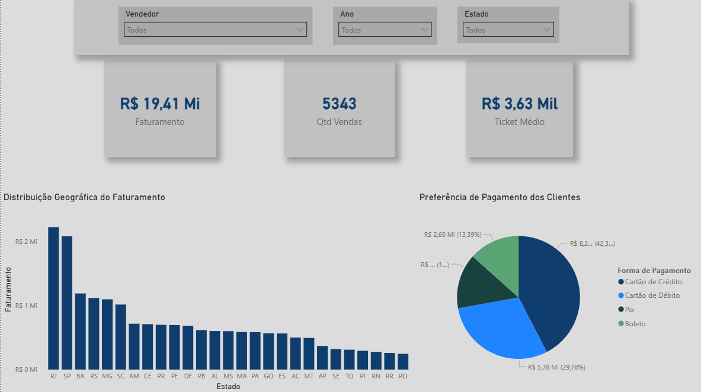
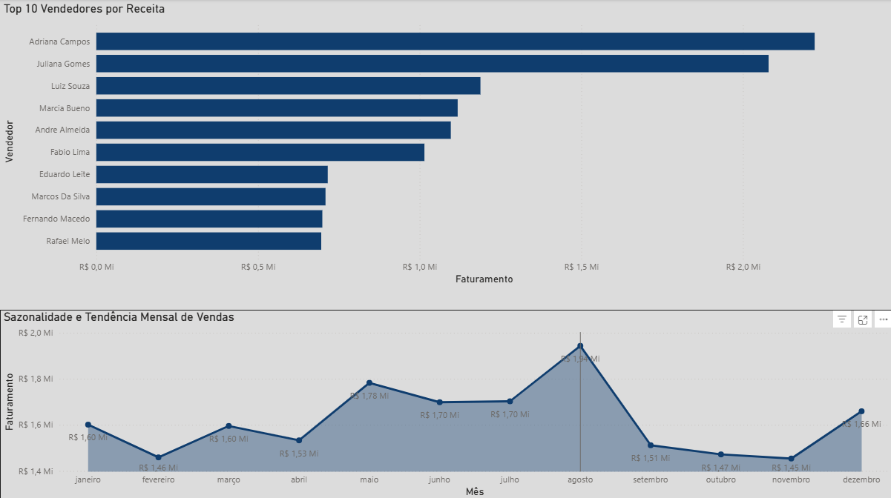

# 📊 Análise de Vendas com SQL & Power BI

## 🎯 Objetivo
Este projeto tem como objetivo analisar dados de vendas para identificar padrões, desempenho de vendedores e comportamento dos clientes, apoiando a tomada de decisão estratégica.

## 🧰 Ferramentas Utilizadas
* **SQL:** Extração e manipulação dos dados brutos.
* **Power BI:** Modelagem de dados e criação de dashboard interativo.
* **DAX:** Criação de medidas inteligentes para análise de performance.

## 📊 Visualização do Dashboard

## 🧠 Inteligência de Dados (DAX)
Para garantir a precisão dos cálculos e permitir o dinamismo dos filtros, utilizei a linguagem **DAX** para criar medidas personalizadas:

* **Faturamento Total:** Realiza a soma dinâmica de todos os valores de venda.
  `Faturamento = SUM(tb_vendas[Valor])`

* **Quantidade de Vendas:** Conta o número total de transações registradas.
  `Qtd Vendas = COUNT(tb_vendas[Valor])`

* **Ticket Médio:** Calcula o valor médio por venda utilizando a função `DIVIDE`, garantindo segurança ao tratar divisões por zero.
  `Ticket Médio = DIVIDE([Faturamento], [Qtd Vendas])`

## 📂 Base de Dados
A base contém informações estruturadas como:
* Data da venda, Estado e Região, Vendedor, Departamento, Forma de pagamento e Valor.

## 📊 Análises Realizadas

### 🔹 Faturamento e Performance
* **Total vendido:** R$ 19.413.049,48
* **Ticket médio:** R$ 3.633,36
* **Top Performance:** Adriana Campos lidera o ranking, seguida por Juliana Gomes e Luiz Souza. Existe uma forte concentração de receita nos primeiros colocados.

### 🔹 Visão Geográfica e Pagamentos
* **Liderança Regional:** O Rio de Janeiro apresenta o maior faturamento, enquanto Roraima detém o menor volume.
* **Preferência de Pagamento:** O Cartão de Crédito é o principal método utilizado (42,3%), liderando tanto em volume quanto em valor.

### 🔹 Comportamento Temporal
* As vendas apresentam variações sazonais, com picos expressivos em períodos específicos (como Agosto e Dezembro), indicando oportunidades para campanhas direcionadas.

## 💡 Principais Insights
| Insight | Descrição |
| :--- | :--- |
| 🎯 Concentração de Receita | Poucos vendedores geram a maior parte do faturamento. |
| 📊 Disparidade de Desempenho | Grande diferença entre o topo e a base do ranking, sugerindo necessidade de treinamento. |
| 💳 Preferência de Crédito | O Cartão de Crédito é o motor principal das vendas. |
| 👥 Performance Média | A maior parte da equipe está no nível médio, representando o sustentáculo da operação. |

## 🚀 Conclusão
A análise destaca uma operação sólida, porém dependente de poucos talentos individuais. Há uma oportunidade clara de aumentar o faturamento médio da equipe e otimizar as vendas nas regiões com menor penetração.

## 📎 Como Executar
1. Importar a base de dados utilizando o arquivo `tabela_de_vendas.sql`.
2. Executar as consultas no arquivo `analise_vendas.sql`.
3. Abrir o arquivo do Power BI (disponível no repositório) para interagir com os filtros.

---
📅 Projeto desenvolvido para portfólio de Análise de Dados | 2026
